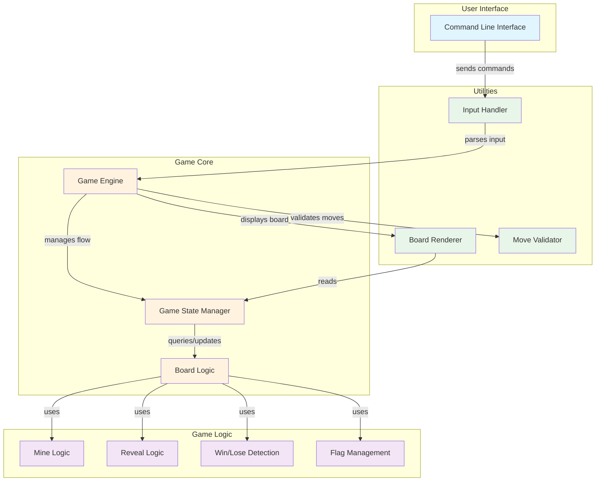

# Go Mine Game - Architecture Overview

This document provides a high-level overview of the go-mine-game architecture.

## System Architecture

## Component Descriptions

### User Interface Layer
- **Command Line Interface**: Entry point for user interactions with the game

### Game Core Layer
- **Game Engine**: Main orchestrator that coordinates game flow and operations
- **Game State Manager**: Maintains current game state (board configuration, flags, revealed cells)
- **Board Logic**: Core board data structure and operations

### Game Logic Layer
- **Mine Logic**: Handles mine placement and mine-related operations
- **Reveal Logic**: Manages cell revelation and cascade effects
- **Win/Lose Detection**: Determines game end conditions
- **Flag Management**: Handles flagging and unflagging cells

### Utilities Layer
- **Board Renderer**: Displays the game board to the player
- **Input Handler**: Processes and parses player commands
- **Move Validator**: Validates user moves before execution

## Data Flow

1. Player enters command via CLI
2. Input Handler parses the command
3. Game Engine receives the validated command
4. Game Engine uses Move Validator to check if the move is legal
5. Game Engine updates Game State and Board Logic
6. Game Logic components execute the move (reveal, flag, etc.)
7. Win/Lose Detection checks for end conditions
8. Board Renderer displays updated board
9. Game continues or ends based on game state
